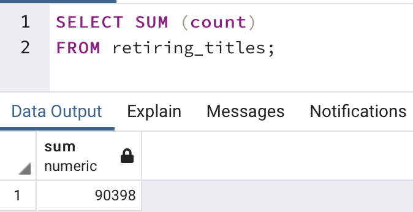
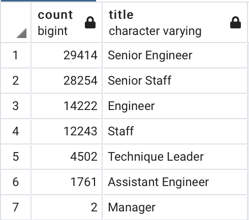
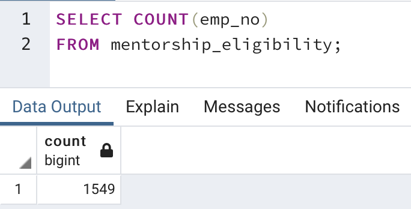
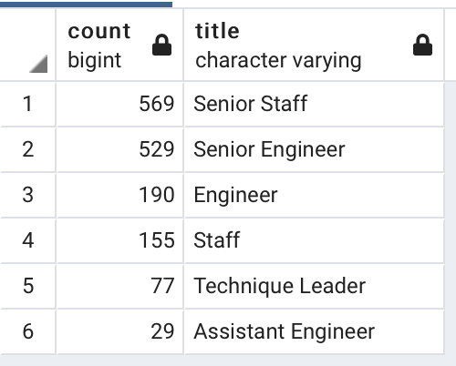
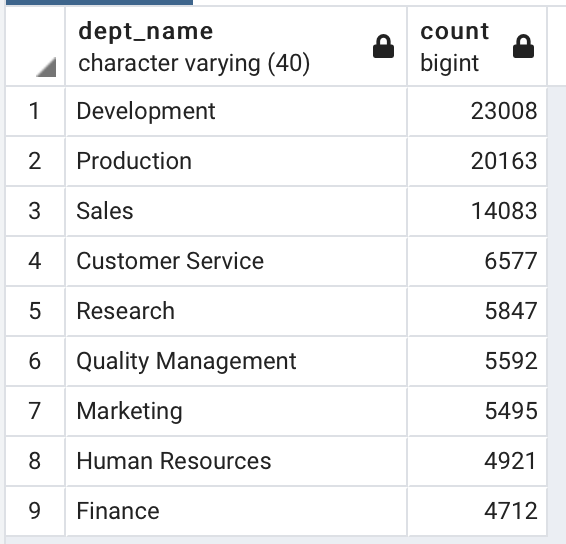
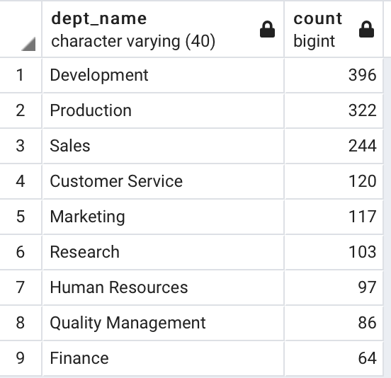

# Employee Database with SQL

## Overview of the Analysis
The study used PostgresSQL to create an employee database out of 6 csv files containing various employee and department information of a large information technology company. The employee database was used to aid Human Resources in generating lists of current employees retiring this year for every department. Results of this analysis will help the company determine the job vacancies that need to be filled as well as the employees qualified to participate in mentorship programs. 

## Results

<p align="center">
    <strong>Retiring Titles Count</strong><br>
    
</p>

<p align="center">
    <strong>Retiring Titles</strong> <br>
    
</p>

<p align="center">
    <strong>Eligible Mentor Count</strong><br>
    
</p>

<p align="center">
    <strong>Eligible Mentor by Title</strong><br>
    
</p>

Key Insights
1)  There are 90,398 current employees born between January 1, 1952 and December 31, 1955 who are retiring.
2)  Senior engineer, senior staff and engineer are the top 3 roles/titles that will need to be filled as a result of the 90,398 retiring employees.
3)  There are 1,549 retirement-ready current employees born between January 1, 1965 and December 31, 1965 who are qualified to mentor the next generation of employees. 
4) The top 3 titles/roles held by these 1,549 qualified mentors are Senior Staff, Senior Engineer and Engineer.

## Summary

A total of 90,398 roles will need to be filled due to the silver tsunami. 

Further analysis indicates that Development, Production, and Sales are the top 3 departments that will experience the most job vacancies. 

```
SELECT DISTINCT ON(ut.emp_no) ut.emp_no, de.dept_no
INTO ret_empno_depno
FROM unique_titles as ut
INNER JOIN dept_emp as de
ON ut.emp_no = de.emp_no
ORDER BY ut.emp_no, de.to_date DESC; 

SELECT d.dept_name, COUNT(red.emp_no)
FROM ret_empno_depno as red
INNER JOIN departments as d
ON red.dept_no = d.dept_no
GROUP BY d.dept_name
ORDER BY COUNT(red.emp_no) DESC; 
```
<p align = center>
    <strong> Retiring Employees by Department</strong><br>
    
</p>

Unfortunately, the 1,549 qualified retirement-ready employees are insufficient to mentor the next generation of employees. 

On a department basis, Development, Production and Sales may have the most eligible mentors. However, none of the 9 departments overall have enough qualified mentors for the next generation of employees. 

```
SELECT DISTINCT ON (me.emp_no) me.emp_no, de.dept_no
INTO ment_empno_depno
FROM mentorship_eligibility as me
INNER JOIN dept_emp as de
ON me.emp_no= de.emp_no 
ORDER BY me.emp_no, de.to_date DESC; 

SELECT d.dept_name, COUNT(med.emp_no)
FROM ment_empno_depno as med
INNER JOIN departments as d
ON med.dept_no = d.dept_no
GROUP BY d.dept_name
ORDER BY COUNT(med.emp_no) DESC;
```
<p align = center>
    <strong> Eligible Mentor by Department</strong><br>
    
</p>